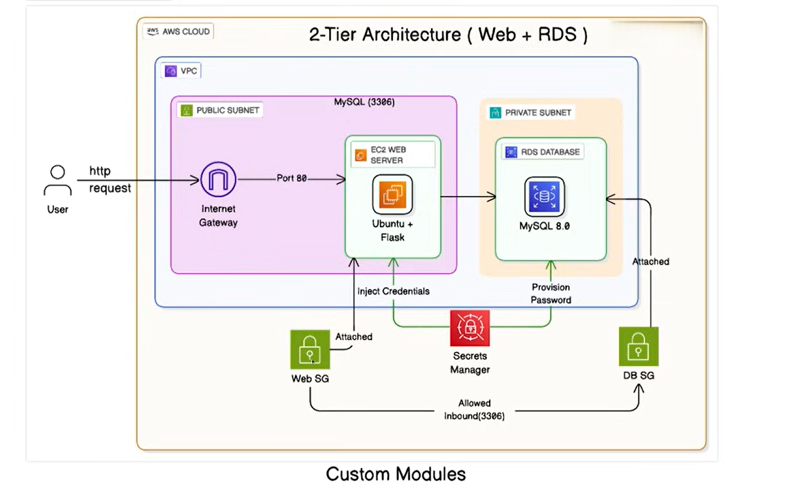
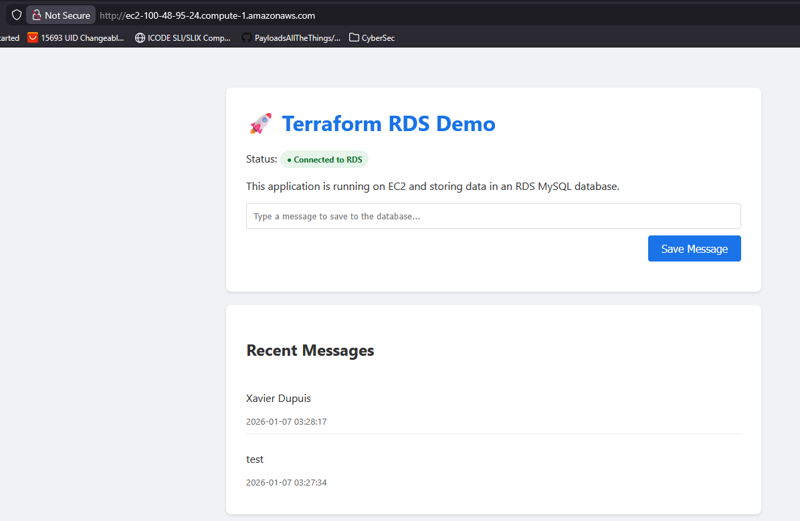

# AWS Two-Tiers Architecture (with RDS database)

## 📌 Project Summary

This project showcases a fully built AWS infrastructure deployed using **Terraform** with a clean **modular design**.  
The goal is to provision a secure and functional web application stack composed of networking, compute, and database layers.

The stack includes:
- A custom **VPC** with public and private subnets
- An **EC2 instance (Ubuntu)** running a Flask web application
- A **MySQL RDS instance** deployed in private subnets
- Fine‑grained **security groups** controlling access between components

All resources are managed as code and can be deployed or destroyed consistently.

---

## 🏗️ High-Level Architecture



The EC2 instance is publicly accessible, while the database remains isolated and only reachable from the web server.

---

## 📁 Project Layout

```
aws_Two-Tiers_Architecture/
├── main.tf
├── variables.tf
├── provider.tf
├── outputs.tf
├── README.md
└── modules/
    ├── vpc/
    ├── security_groups/
    ├── rds/
    └── ec2/
        └── templates/
            └── user_data.sh
```

Each major AWS component is isolated into its own Terraform module for clarity, reuse, and maintainability.

---

## ⚙️ Requirements

Before deploying, ensure you have:

- An AWS account
- AWS CLI installed and authenticated
- Terraform **v1.0 or newer**
- IAM permissions for EC2, VPC, RDS, and Security Groups

---

## 🚀 Deployment Steps

### 1. Initialize Terraform
```
terraform init
```

### 2. Preview Changes
```
terraform plan
```

### 3. Apply Infrastructure
```
terraform apply
```

### 4. Access the Application

After deployment, retrieve the application URL:
```
terraform output application_url
```



Available endpoints:
- `/` → Home page
- `/health` → Database connectivity check
- `/db-info` → Database metadata

---

## 🧹 Destroy Resources

To remove all provisioned infrastructure:
```
terraform destroy
```

---

## 🧩 Module Overview

### VPC Module
- VPC creation
- Public & private subnets
- Internet Gateway and routing

### Security Groups Module
- Web SG: HTTP (80) + SSH (22)
- DB SG: MySQL (3306) from EC2 only

### RDS Module
- MySQL instance
- Private subnet group
- Secure internal access

### EC2 Module
- Ubuntu instance
- Flask application
- MySQL client installed
- App managed via systemd

---

## 🔐 Security Considerations

- SSH is open to `0.0.0.0/0` for demonstration only
- Database credentials are stored in Terraform variables
- RDS encryption and Secrets Manager are recommended for production
- Principle of least privilege should be applied in IAM roles

---

## 🛠️ Troubleshooting

- **Web app not loading**: Wait a few minutes for EC2 user-data execution
- **Database errors**: Confirm RDS status and security group rules
- **Slow provisioning**: RDS creation can take up to 10 minutes

---

## References

- Terraform Registry
- Tech Tutorials with Piyush (day 22/30)
- Terraform AWS Provider Documentation

## 👤 Author

**Xavier Dupuis**

